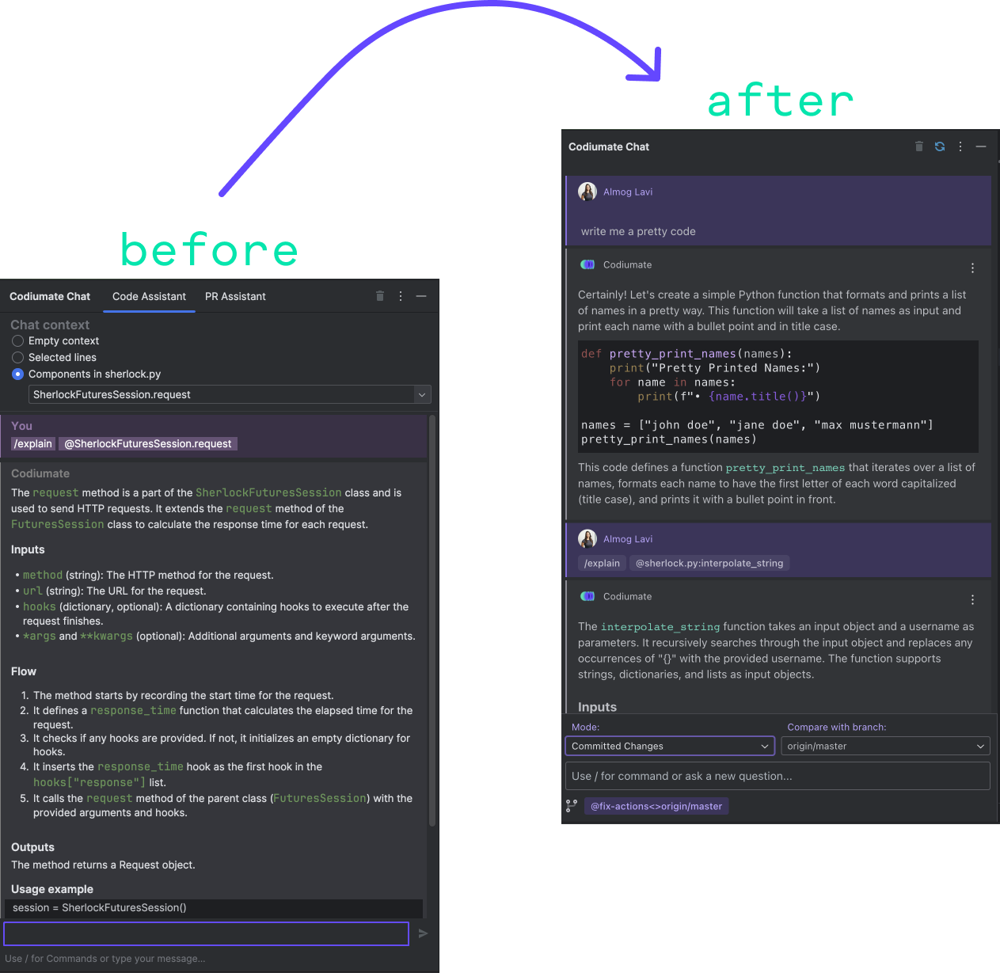
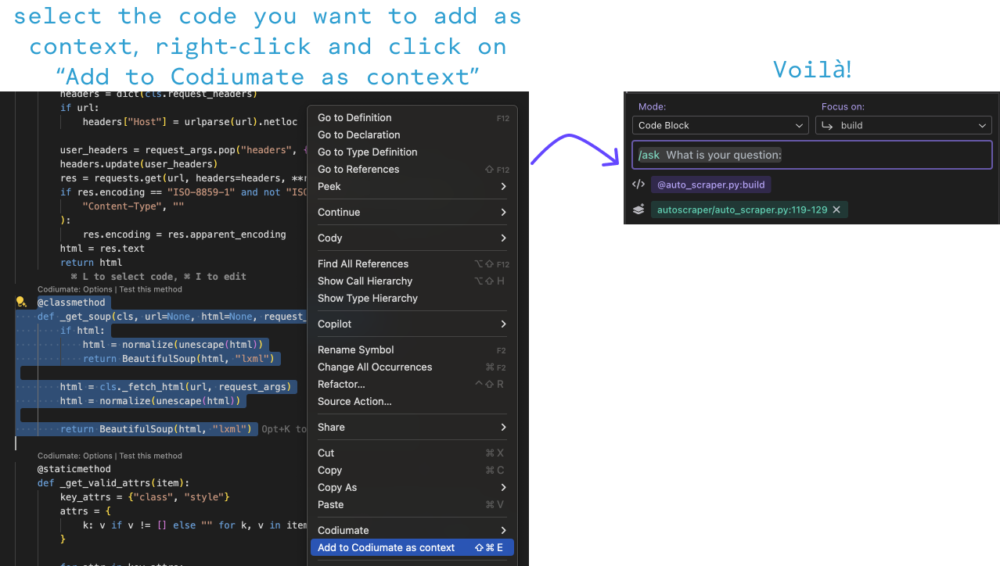

# Latest
## March 29, 2024

## Codiumate

### JetBrains

**[Full Release Notes](./versions/2024-3-29/codiumate-jb.md)**

Our JetBrains plugin now has a **New Chat Interface!**

Our incredible JetBrains team has put in a lot of hard work, and we're excited to unveil a new chat interface that looks and feels more like 2024 and less like.. well.. 2023. The new interface looks just like our VSCode chat. We are now working on adding all the features that we have in VSCode.

Check it out:

<figure markdown="1">
{ width="600" }
</figure>

### VSCode

**[Full Release Notes](./versions/2024-3-29/codiumate-vscode.md)**

We're cooking up something exciting, and you'll hear about it soon. But in the meantime, we've introduced some really cool features that will enhance the existing ones and make them even more awesome! One of these enhancements includes... adding more context! 🍾

Codiumate chat now allows you to include more context when sending any command, ensuring you get better results. This context can be drawn from the current repository or any other repository you want!

See how it works:

<figure markdown="1">
{ width="700" }
</figure>

## PR Agent