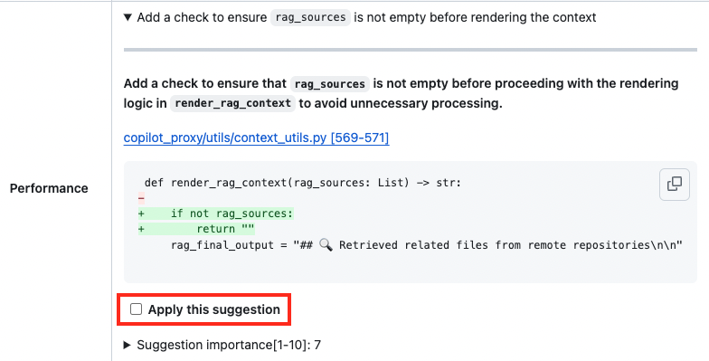
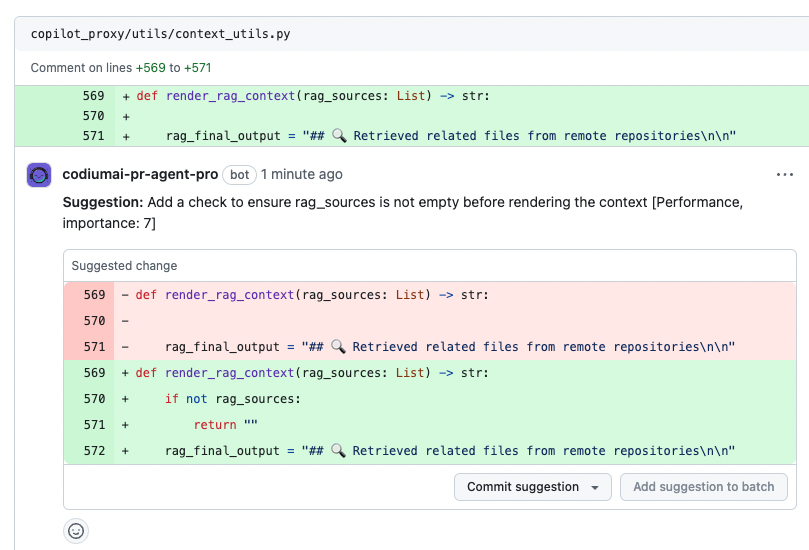

---
hide:
  - navigation
  - toc
---

{ class="no-border"}
### v0.22 | May 30, 2024

##
# Apply Code Suggestion with **One Click**

In the latest PR-Agent Pro we've introduced a new way of improving your code - 

You can now Interactively convert a specific suggestion to a committable one, with just checking the check-box inside each suggesion!

**Check it out:**

#### Select the check-box of the desired suggestion:

#### A committable comment will be added to your diff:

---

# **Chrome Extension** v1.15 🕵️‍♂️

The new PR-Agent Chrome Extension version now added 2 new features:

1. PR-Agent **Filters** - Easily switch between PR-Agent comments, Non-PR-Agent comments, and all comments to focus on what matters.

2. **Enhanced** Code Suggestions - Use the new quote button to add specific code suggestions as comments and tag your teammates for seamless collaboration.

### **[Download Chrome Extension](https://chromewebstore.google.com/detail/pr-agent-chrome-extension/ephlnjeghhogofkifjloamocljapahnl)**

{: style='width: 60%; height: 30.172vw'}

---

## **What's next** for PR-Agent Chrome Extension?

- A private chat panel inside your PR, to chat about any topic related to your PR.
- A private chat panel inside your project, which indexes your full project and lets you chat and ask any question about your code.

---

### **[Read CodiumAI Release Notes Digest](../../index.md)**

