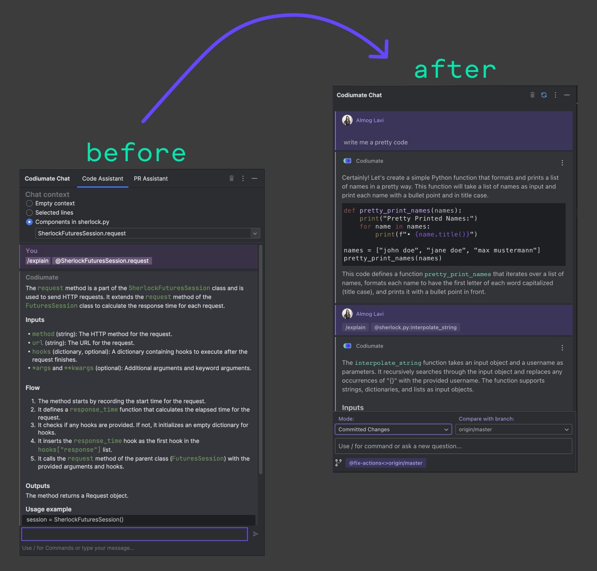

# Codiumate JetBrains v0.7.27

## New Chat Interface

Our JetBrains plugin now has a **New Chat Interface!**

Codiumate Chat now suppoorts a modern interface with JetBrains IDEs. The interface has been redesign for a smoother experience and now matches the design language of Codiumate for VSCode.

**Check it out:**

<figure markdown="1">
{ width="600" }
</figure>

### Supported Commands and Modes

All the previous commands and modes that were supported in the previous design is also supported in the new design, it just looks a bit different.

Instead of "Code Assistant" and "PR Assistant" tabs, you now have a drop-down with all the supported modes:

- **Free Chat mode** - for code-related chat with ChatGPT
- **File mode** - select component or code snippet and choose a command with `/`
- **Workspace mode** - currently supports Committed Changes (like before)

We are adding all the other modes and commands, you will see a `SOON` label near them.

Read more about the chat in our **[Documentation Portal](https://codiumate-docs.codium.ai/chat/)**

## Issue with Android Studio

There's a known issue with Android Studio, which doesn't support JCEF 😕, but there's a workaround that should help. **[Read more about it here](http://codiumate-docs.codium.ai/installation/jetbrains/#android-studio-support-jcef)**.

## OptOut from Data Training directly from the plugin

Free users can now Opt Out from the model training directly from our plugin settings. In order to do that, go to the Plugin Settings, and check `Opt out of sharing my data with Codium AI` checkbox. **[Read More](http://codiumate-docs.codium.ai/installation/opt-out/)**.

## Bug fixes

- Fixed broken (by JetBrains) Python support in none PC 2024.1 IDEs.
- Fixed more "Slow call on EDT ..." errors in recent 2024.1
