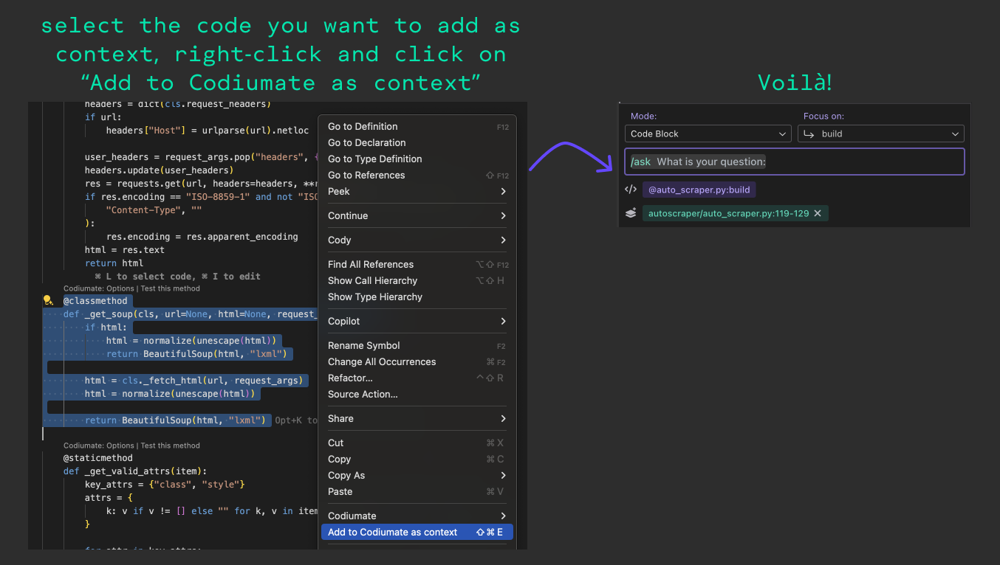

# Codiumate VSCode v0.7.54

## Add Context to Codiumate Chat

We're cooking up something exciting, and you'll hear about it soon. But in the meantime, we've introduced some really cool features that will enhance the existing ones and make them even more awesome! One of these enhancements includes... adding more context! 🍾

Codiumate chat now allows you to include more context when sending any command, ensuring you get better results. This context can be drawn from the current repository or any other repository you want!

In order to add more context, select a code snippet, right-click on it and choose `add to Codiumate as context`, or simply click on SHIFT+CMD+E in Mac or SHIFT+CTRL+E in Windows.

See how it works:

<figure markdown="1">
{ width="700" }
</figure>

## Code Auto-Complete

Did you know we have an auto-complete feature hidden in your settings? Why is it hidden? Well, it is still in beta, but you can use it today and let us know what you think 😁

Simply go to the extension settings -> check `Codium > Code auto-complete`.

You can even add your instructions to the auto-complete suggestions by going to `Codium > Code auto-complete user instrucstion` and adding your own snippets.

We would love to hear if how it worked for you! Share yout thoughts and feedback on our [Discord Community](https://discord.gg/codiumai-1057273017547378788).

## Bug fixes

- We fixed the chat behavior when there's not file in focus.
- Fixed the context handling in the chat panel when there's no git context.
