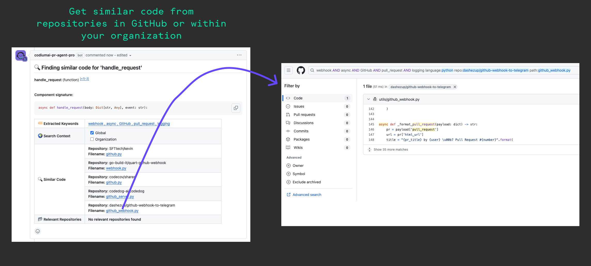

---
hide:
  - navigation
  - toc
---

{ class="no-border"}
### v0.21 | March 28, 2024

## Continous Improvment 🚀

As always, our PR-Agent open-source is getting better and better and has more capabilities, with the great help from our **dear contributors**.

If you haven't seen yet, we have a **[new documentation portal](https://pr-agent-docs.codium.ai/)** that contains all the information you need to know about installing and working with PR-Agent.

---

## Recent changes

- Added support for Bedrock Claude3 models in the AI handlers.
- Added an option to ignore pull requests opend by bots such as `renovate[bot]`.
- PR-Agent is now available to be installed via pip! Add Pypi support for PR Agent. **[Read More](https://test.pypi.org/project/pr-agent/)**.
- Added `Similar Code` tool, which searches similar code in GitHub or inside your organization, using keyworkds. **[Read more](https://pr-agent-docs.codium.ai/tools/similar_code/)**.

 
**See how Similar Code looks like:**

{ width="700" }

---

### **[Read CodiumAI Release Notes Digest](../../index.md)**

