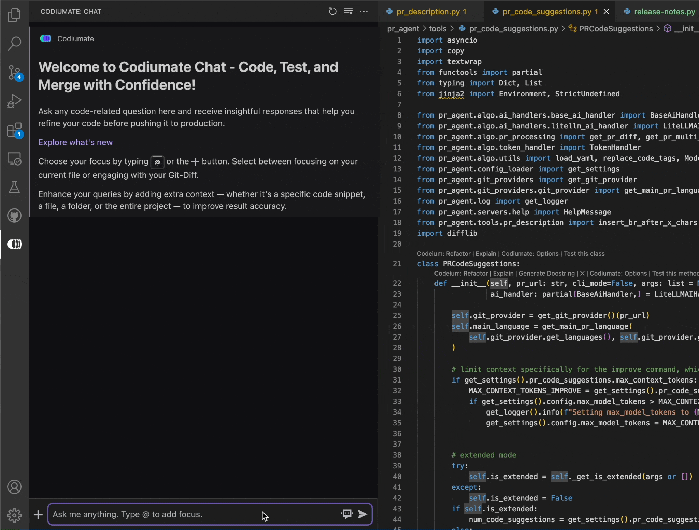

---
hide:
  - navigation
  - toc
title: Codiumate VScode Release Notes
subtitle: Codiumate plugin for JetBrains v0.7.30 Release Notes
---

{ class="no-border"}

### v0.9 | May 30, 2024

###
# New Chat Interface with **Project Context**!

We're excited to unveil Codiumate v0.9, which introduces a sleek, redesigned interface and enhanced **project indexing capabilities**. This update makes navigating and using Codiumate Chat more intuitive and user-friendly, allowing you to quickly select your coding focus with new shortcuts like `@` and the `+` button. 

We've also expanded the ways you can add context to your requests—now including code snippets, files, folders, or your entire project, ensuring responses are precisely tailored to your needs. Additionally, the new coding-agent can be activated with just a click, providing expert assistance tailored to your coding challenges. 

### **🤩 See how it looks:**

#### Choose focus
{width=70%}

#### Add Extra Context
{width=70%}

--- 

## Using **GPT-4o** in Test Generation

The latest update to Codiumate incorporates GPT-4o, an advanced iteration of the Generative Pre-trained Transformer model, to revolutionize the way we generate tests. This integration significantly enhances our ability to produce intelligent, context-aware test suggestions. With GPT-4o, developers can expect more refined and accurate test cases, which are crucial for maintaining high-quality software. 

--- 

## Adding **Vitest** Framework to Supported Frameworks List

After much anticipation, we are thrilled to announce the addition of the Vitest framework to Codiumate's list of supported testing frameworks in JavaScript and TypeScript. Vitest, a modern testing framework tailored for JavaScript environments, aligns perfectly with the needs of contemporary developers. 

--- 

**Stay tuned for more updates!**

---

### **[Read CodiumAI Release Notes Digest](../../index.md)**

